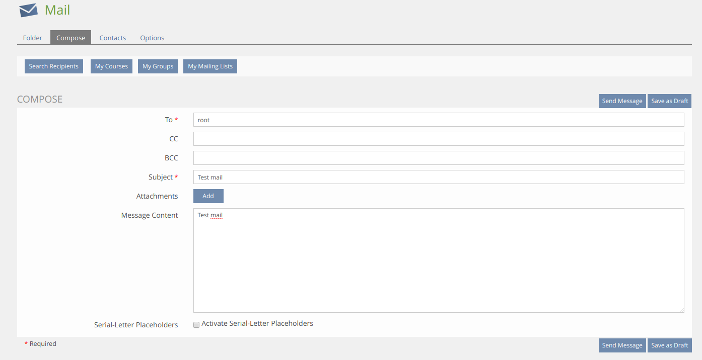

## Installation

### Install MailLogger-Plugin
Start at your ILIAS root directory
```bash
mkdir -p Customizing/global/plugins/Services/EventHandling/EventHook
cd Customizing/global/plugins/Services/EventHandling/EventHook
git clone https://github.com/studer-raimann/MailLogger.git MailLogger
```
Update, activate and config the plugin in the ILIAS Plugin Administration

### Menu (Only ILIAS 5.3)
For ILIAS 5.3, you need to install [CtrlMainMenu](https://github.com/studer-raimann/CtrlMainMenu) before you activate the MailLogger-Plugin

### ILIAS-Core-Patch (Only ILIAS 5.3)
In order for log sending emails correctly in ILIAS 5.3, it needs some patches in the ILIAS core:

1. Event for send internal emails:
`Services/Mail/classes/class.ilMail.php::sendInternalMail`:
```php
...
class ilMimeMail
{
	...
	public function sendInternalMail(
    		$a_folder_id, $a_sender_id, $a_attachments, $a_rcp_to, $a_rcp_cc, $a_rcp_bcc,
    		$a_status, $a_m_type, $a_m_email, $a_m_subject, $a_m_message, $a_user_id = 0,
    		$a_use_placeholders = 0, $a_tpl_context_id = null, $a_tpl_context_params = array()
    	)
    	{
    	...
		//PATCH MailLogger Event for send internal emails
		$mbox = new ilMailbox();
		$mbox->setUserId($a_user_id);
		//Only save outgoing mails not mails saved in sent folder
		if ($mbox->getSentFolder() != $a_folder_id) {
			global $DIC;
			$DIC->event()->raise("Services/Mail", "sentInternalMail", [
				"subject" => $a_m_subject,
				"body" => $a_m_message,
				"type" => $a_m_type,
				"from_usr_id" => $a_sender_id,
				"to_usr_id" => $a_user_id,
				"context_ref_id" => $a_tpl_context_id
			]);
		}
		//PATCH MailLogger

		return $next_id;
    }
    	...
}
```
2. Event for send external emails:
`Services/Mail/classes/Mime/Transport/class.ilMailMimeTransportBase.php::send`:
```php
...
abstract class ilMailMimeTransportBase implements ilMailMimeTransport
{
	...
	final public function send(ilMimeMail $mail)
		...
		if($result)
		{
			ilLoggerFactory::getLogger('mail')->debug(sprintf(
				'Successfully delegated external mail delivery'
			));
		
			//PATCH MailLogger Event for send external emails:
			global $DIC;
			$DIC->event()->raise("Services/Mail", "externalEmailDelegated", [ "mail" => $mail ]);
			//PATCH MailLogger
		}
		else
			ilLoggerFactory::getLogger('mail')->warning(sprintf(
				'Could not deliver external email: %s', $this->getMailer()->ErrorInfo
			));
		}

		return $result;
	}
}
```

### Some screenshots
Config:


Send test mail:


Log table:


Show email:


### Dependencies
* ILIAS 5.3 or ILIAS 5.4
* PHP >=7.0
* [composer](https://getcomposer.org)
* [srag/activerecordconfig](https://packagist.org/packages/srag/activerecordconfig)
* [srag/custominputguis](https://packagist.org/packages/srag/custominputguis)
* [srag/dic](https://packagist.org/packages/srag/dic)
* [srag/librariesnamespacechanger](https://packagist.org/packages/srag/librariesnamespacechanger)
* [srag/removeplugindataconfirm](https://packagist.org/packages/srag/removeplugindataconfirm)

Please use it for further development!

### Adjustment suggestions
* Adjustment suggestions by pull requests
* Adjustment suggestions which are not yet worked out in detail by Jira tasks under https://jira.studer-raimann.ch/projects/PLMALOG
* Bug reports under https://jira.studer-raimann.ch/projects/PLMALOG
* For external users you can report it at https://plugins.studer-raimann.ch/goto.php?target=uihk_srsu_PLMALOG

### ILIAS Plugin SLA
Wir lieben und leben die Philosophie von Open Source Software! Die meisten unserer Entwicklungen, welche wir im Kundenauftrag oder in Eigenleistung entwickeln, stellen wir öffentlich allen Interessierten kostenlos unter https://github.com/studer-raimann zur Verfügung.

Setzen Sie eines unserer Plugins professionell ein? Sichern Sie sich mittels SLA die termingerechte Verfügbarkeit dieses Plugins auch für die kommenden ILIAS Versionen. Informieren Sie sich hierzu unter https://studer-raimann.ch/produkte/ilias-plugins/plugin-sla.

Bitte beachten Sie, dass wir nur Institutionen, welche ein SLA abschliessen Unterstützung und Release-Pflege garantieren.
